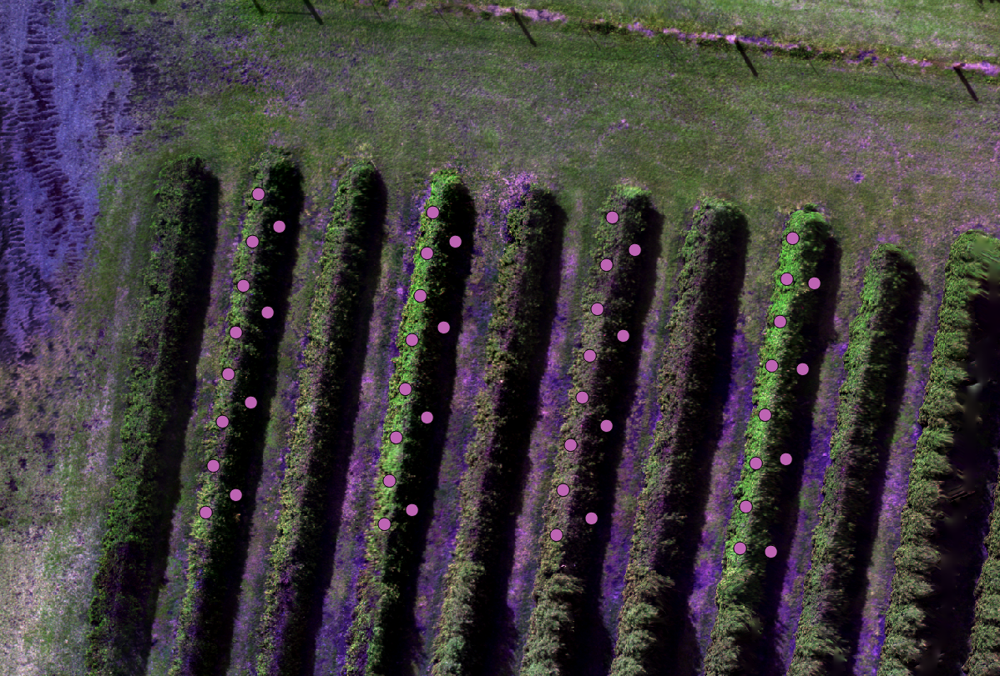

% Code

The following code extracts reflectance values from a multispectral aerial image
and then tests whether it is possible to build a classification model that can 
accurately discriminate _Backhousia citriodora_ (lemon myrtle) trees trees infected with myrtle rust (caused by _Austropuccinia psidii_) and healthy ones. 

# Setup coding environment

## Install and load packages

Please run the following code to install required R packages
```{r installpkgs, eval=FALSE}

install.packages(c("rgdal", 
                   "raster", 
                   "roxygen2",
                   "tictoc", 
                   "tidyverse", 
                   "caret",
                    "e1071", 
                   "gdata", 
                   "hsdar", 
                   "utils", 
                   "magrittr", 
                   "rasterVis",  
                   "rmarkdown"))
```

Now we load the installed packages:
```{r loadpkgs, results='hide', message=FALSE, warning=FALSE}
library(rgdal) #load installed pkgs
library(raster)
library(tictoc)
library(caret)
library(gdata)
library(hsdar)
library(utils)
library(rasterVis)
library(rmarkdown)
library(roxygen2)
library(magrittr)
library(knitr)
library(reshape2)
library(cowplot)
```

Also the necessary functions, which can be download from the GitHub repository:
```{r loadfcts}
source("R/FUN_raw2speclibhsdar.R")#coverts spec data to hsdar lib
source("R/FUN_drop_cat_var.R")#drops factor and factor level
source("R/FUN_extract_pixel.R")
source("R/FUN_caretout.R")
source("R/FUN_prepggwide2long.R")
```

And create a directory for the analysis output:
```{r createdir}
dir.create("output", FALSE, FALSE)
```

## Loading and preparing data

First we loaded a five-band aerial .tif image captured on our field site (1). 
Then we renamed each channel according to the camera the image was captured (2).
(Band1(blue=475nm), Band2 (green=560nm), Band3 (Red=668nm), Band4 (840nm), Band5 (rededge=717nm), Band6 (alphaband))
```{r brick}
img <-
  brick("data/FullOrtho_crop.tif") #1
  img@data@names <-
  c("Blue", "Green", "Red", "NIR", "RedEdge", "Alpha") #2
```

The scene looks like this:
```{r img, echo=FALSE, out.width='100%'}
ext <- extent(153.2954, 153.2958, -28.69125, -28.69093)
plotRGB(img, r = 3, g = 2, b = 1, ext=ext)
```

Then we can load a shape file (created with QGIS) to overlay polygons from where 
we sample pixel representing "Treated", "Untreated" and "Shadow" regions of each
tree. Here are the sample regions:
```{r shp}
alldata <- shapefile("data/20180427mrdrone_trainpolyforR.shp")
```

```{r echo=FALSE, out.width='100%', fig.cap="Sample"}

```
Now, that we have both objects available (img and alldata), we can extract the 
pixel values where we positioned the polygons.
```{r extract}
dfAll <- extract_pixel(img, alldata)
head(dfAll)
```

Unfortunately, we only have the ID in our new data. We have to replace this with
each class to make the classification easier to interpret.
```{r getpixeldata}
# Constructing table

Treatment <- alldata$Type
ID <- alldata$id

dfclass <- cbind(Treatment, ID)

# Looks up IDs that are linked to class labels and splits them up

classvec <- unique(as.character(dfclass[,1]))
li <- list()

for(i in classvec){
  x <- subset(dfclass, dfclass[,1] == i)
  li[[i]] <- assign(paste0(i,"_","num"), as.numeric(x[,2]))
  }

# Reassembles a df that has written the class labels instead of ID numbers

for(i in UN_num){
dfAll$class[dfAll$class == i] <- "UN"
}

for(i in TR_num){
  dfAll$class[dfAll$class == i] <- "TR"
}

for(i in SHD_num){
  dfAll$class[dfAll$class == i] <- "SHD"
}

dfAll$class <- as.factor(dfAll$class)
names(dfAll)[7] <- c("Type")
```

Now we divide by 65535 to transform the digital number stored in our multilayer 
image into reflectance.
```{r DNREF}
dfAll[,1:5] <- dfAll[,1:5]/65535#divide by 65535 to yield refl between 0 and 1
```

Eventually, we can write/export our data to have it available for future analysis.
```{r writepixel}
write.csv(dfAll[,1:7], 'output/2018MyrtleRust_Refl.csv', row.names = FALSE)
classif <- read.csv("output/2018MyrtleRust_Refl.csv")
classif <- classif[,c(1,2,3,4,5,7)] # remove alpha band, not required for clas
classif <- classif[,c(6,1,2,3,5,4)]
unique(classif$Type)
```

Plot part A of spectra
```{r spectraI, echo=FALSE}
classifp <- classif
names(classifp) <- c("Type", "475", "560", "668", "717", "840")
spectragg <- prep_gg(classifp)

a <- ggplot(spectragg, aes(Wavelength, Reflectance, colour = Type)) +
  geom_line(aes(linetype=Type), size = 1)+
  geom_point(aes(shape=Type), size = 2)
```


## Classification Part A (Aerial 3-Class)

First we set a seed to avoid random number generation in vulnerable processes (1).
Then we partition the extracted pixel data in a training and test subset (2).
Finally, we control the settings for the random forest training process (3-4).
```{r classifA}
set.seed(20180427) #1

inTraining <- createDataPartition(classif$Type, p = .75, list = FALSE)
train <- classif[ inTraining,]
test  <- classif[-inTraining,] #2

rfControl <- trainControl(
  method = "boot",
  number = 1
  ) #3

rfGrid <- expand.grid(mtry = seq(1, ncol(train)-1, 1)) #4
```

Once we tuned the settings, we can run the training process.

```{r starttiming, echo=FALSE}
tic("RF.I") #Start timing
```
```{r train RF.I}
rfFit <- train(Type ~ ., data = train,
               method = "rf",
               importance = TRUE, ntree=5,
               trControl = rfControl, tuneGrid = rfGrid,
               metric = "Accuracy", maximize = TRUE)
```
Then we validate the model on the not yet seen data partition.
```{r predA}
rfPred <- 
  predict.train(rfFit, test[, !names(test) %in% c("Type")], type = "raw")
```
```{r, echo=FALSE}
toc() # Stop timing
```

Eventually, we can export our results.
```{r expA}

Mica.Prediction <- 
  list(fit = rfFit,
  pred = predict.train(rfFit, test[, !names(test) %in% c("Type")], type = "raw"),
  confusion = confusionMatrix(rfPred, test$Type),
  varImp = varImp(rfFit, scale = FALSE))

sink(file = 'output/I_AllClasses.txt')
Mica.Prediction
sink()

saveRDS(Mica.Prediction, 'output/I_AllClasses.rds')
Mica.Prediction <- readRDS("output/I_AllClasses.rds")
```

## Risk map
```{r risk}
imgpred <-  brick("data/20180427_orthophoto_noground_MRDrone.tif") # load lemon 
#myrtle trees without ground to predict wo grass
NAvalue(imgpred)
NAvalue(imgpred) <- 65535

    riskpre <- subset(imgpred, 1:5) # remove alpha/transparency channel as it 
    #was not used as a predictor var in rf 
        risk <- riskpre/65535 # divide by 65535 to change values to reflectance
            risk@data@names <- 
              c("Blue", "Green", "Red", "NIR", "RedEdge", "Alpha") # rename

            riskpred <- predict(risk, Mica.Prediction$fit)
            
            
            
            miat = c(0, 0.33, 0.66, 1)
            classcolor <- c("#0F0F0F", "#1CEB15", "#F21D1D")
            levelplot(riskpred,
                      margin = FALSE,
                      at = miat,
                      col.regions= classcolor)

                currentDate <- Sys.Date()
                rstFileName <- paste("output/riskmap",currentDate,".tif",sep="")
                writeRaster(riskpred, 
                            file=rstFileName, 
                            format = "GTiff", 
                            overwrite=TRUE)
                #NOTE should wrap this file output in function
```

## Leaf-scale vs canopy scale

First, we load hyperspectral leaf data from a previous study.
```{r hypdata}
hypdata <- read.csv('data/data.wo.out.binned.cut.csv', check.names = FALSE)
hypdata <- drop_class(hypdata, hypdata$Type, "Healthy")

speclib <- raw2speclib(hypdata)
```

Plot part B of spectra:
```{r plotb}
spectraggII <- prep_gg(hypdata)

b <- ggplot(spectraggII, aes(Wavelength, Reflectance, colour = Type)) +
  geom_line(aes(linetype=Type), size = 1)+
  geom_point(aes(shape=Type), size = 2)
```

We can resample the leaf data to the specifications of our multispectral camera.
```{r resamp}
center <-  c(475, 560, 668, 717, 840)
fwhm <- c(20, 20, 10, 10, 40)

micasense <- as.data.frame(cbind(center, fwhm))

data_mica <- spectralResampling(speclib, micasense)

micadata <- as.data.frame(data_mica@spectra@spectra_ma)
micadata <- cbind('Type'=hypdata$Type, micadata)
```

Plot part C
```{r plotc}
names(micadata) <- c("Type", "475", "560", "668", "717", "840")

spectraggIII <- prep_gg(micadata)

c <- ggplot(spectraggIII, aes(Wavelength, Reflectance, colour = Type)) +
  geom_line(aes(linetype=Type), size = 1)+
  geom_point(aes(shape=Type), size = 2)
```

Add new names for classification
```{r}
names(micadata) <- c("Type", "Blue", "Green", "Red", "RedEdge", "NIR")
```

## Classification Part B (Resample)

```{r classifB}
inTrainingM <- createDataPartition(micadata$Type, p = .75, list = FALSE)
trainM <- micadata[ inTrainingM,]
testM  <- micadata[-inTrainingM,]

rfControl <- trainControl(
  method = "boot",
  number = 1
)

rfGrid <- expand.grid(mtry = seq(1, ncol(trainM)-1, 1)) 
```

Again, we partition the extracted pixel data in a training and test subset (1).
Finally, we control the settings for the random forest training process (2-3).
```{r, echo=FALSE}
tic("RF.II") #Start timing
```

```{r trainB}
rfFit.M <- train(Type ~ ., data = trainM,
               method = "rf",
               importance = TRUE, ntree=5,
               trControl = rfControl, tuneGrid = rfGrid,
               metric = "Accuracy", maximize = TRUE)
```

Then we run the validation process.
```{r predB}
rfPred.M <- 
  predict.train(rfFit.M, testM[, !names(testM) %in% c("Type")], type = "raw")


Mica.Resamp.Prediction <- 
  list(fit = rfFit.M,
  pred = predict.train(rfFit.M, testM[, !names(testM) %in% c("Type")], type = "raw"),
  confusion = confusionMatrix(rfPred.M, testM$Type),
  varImp = varImp(rfFit.M, scale = FALSE))

sink(file = 'output/II_ResampLeafPred.txt')
Mica.Resamp.Prediction
sink()

saveRDS(Mica.Resamp.Prediction, 'output/II_ResampLeafPred.rds')
```
```{r}

toc() # Stop timing
```

## Classification Part C (Aerial 2-Class)

As there is no class "SHADOW" available for the leaf data we first need to drop 
this class for the aerial imagery as well.
```{r classifC}
classif2 <- DropClass(classif, classif$Type, 'SHD')
unique(classif2$Type)
```

Then we partition the data again and tune the model settings.
```{r trainC}
inTrainingD <- createDataPartition(classif2$Type, p = .75, list = FALSE)
trainD <- classif2[ inTrainingD,]
testD  <- classif2[-inTrainingD,]

rfControl <- trainControl(
  method = "boot",
  number = 1
)

rfGrid <- expand.grid(mtry = seq(1, ncol(trainD)-1, 1)) 
```
```{r}
tic("RF.III") #Start timing
```

We fit the model.
```{r fitC}
rfFit.D <- train(Type ~ ., data = trainD,
                 method = "rf",
                 importance = TRUE, ntree=5,
                 trControl = rfControl, tuneGrid = rfGrid,
                 metric = "Accuracy", maximize = TRUE)
```

And validate.
```{r predC}
rfPred.D <- 
  predict.train(rfFit.D, testD[, !names(testD) %in% c("Type")], type = "raw")
```

Then export the results.
```{r expC}

Mica.LeafSim.Pred <- 
  list(fit = rfFit.D,
  pred = predict.train(rfFit.D, testD[, !names(testD) %in% c("Type")], type = "raw"),
  confusion = confusionMatrix(rfPred.D, testD$Type),
  varImp = varImp(rfFit.D, scale = FALSE))

sink(file = 'output/III_Mica.LeafSim.Prediction.txt')
Mica.LeafSim.Pred
sink()

saveRDS(Mica.LeafSim.Pred, 'output/III_Mica.LeafSim.Pred.rds')
toc() # Stop timing
```

It might be helpful to compare all the relevant spectra.
```{r finplot, echo=FALSE}
res <- ggdraw() +
  draw_plot(a, x = 0, y = .66, width = 1, height = .33)+
  draw_plot(b, x = 0, y = .33, width = 1, height = .33) +
  draw_plot(c, x = 0, y = 0, width = 1, height = .33) +
  draw_plot_label(label = c("A", "B", "C"), size = 12,
                  x = c(.12,.12,.12), y = c(0.99,0.66,0.33))
```

```{r}
ggsave("output/Figure2.allspectra.png",
    plot = res,
    width = 40,
    height = 20,
    units = "cm",
    dpi = 400
  )
```

NOTES

- Be careful with renaming columns for micasense bands! Check order!! 
- Compare feature selection between classifications! 
- How many bootstrap samples are recommended? As many as trees? 
- Sample size between classifications?


